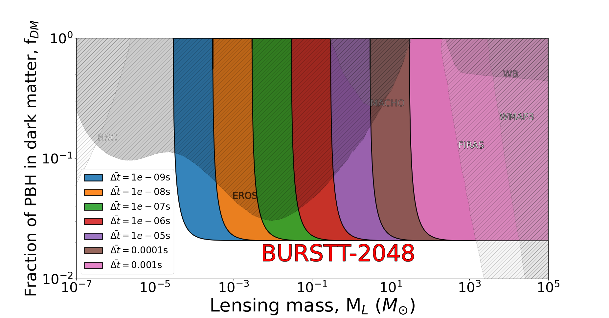
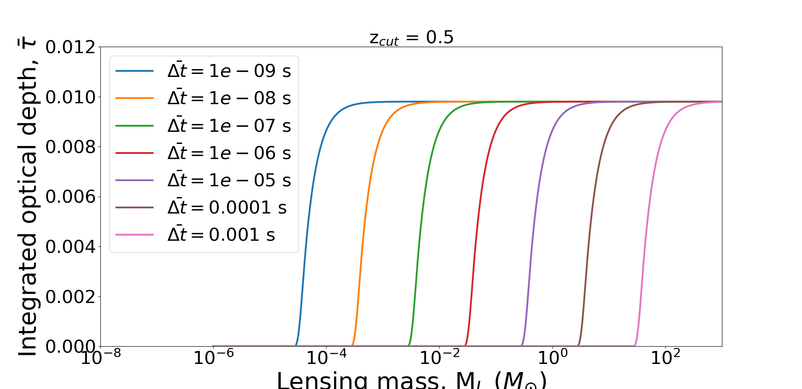

# 🌸PriBLOOM **Pri**mordial **B**lack hole **L**ensing **O**ptical depth analysis with **O**bservations from **M**onitoring surveys

This repository contains code to compute and visualize the gravitational lensing optical depth for primordial black holes (PBHs), using cosmological models and FRB-like time delay constraints. We use the Bustling Universe Radio Survey Telescope in Taiwan (BURSTT) in this repository as an example.

## Structure

- `scripts/tau_vs_mass_plot.py`  
  Script to plot **f<sub>DM</sub> vs lensing mass**, comparing against constraints from EROS, MACHO, FIRAS, etc.
  
- `scripts/integrated_tau_plot.py`  
  Script to plot **optical depth τ vs lensing mass**, for various time delays.

- `DMconstrain/`  
  Contains constraint data from external sources (EROS, MACHO, WMAP3, etc.).

## Dependencies

Install dependencies with:

```bash
pip install -r requirements.txt
```

## Usage
To plot the f<sub>DM</sub> vs lensing mass plot
```python
python scripts/tau_vs_mass_plot.py
```  

To plot the optical depth τ vs lensing mass plot
``` python
python scripts/integrated_tau_plot.py
```


## Example plots
- f<sub>DM</sub> vs lensing mass plot  
  

- Optical depth τ vs lensing mass plot  


## Citation
Please cite [Ho et al. 2023, ApJ](https://iopscience.iop.org/article/10.3847/1538-4357/accb9e) if you use the code in your paper.

